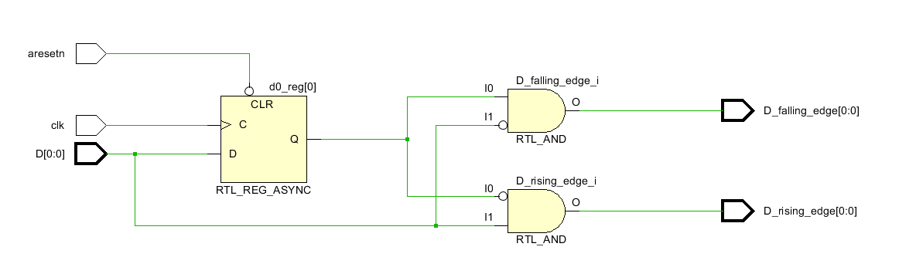
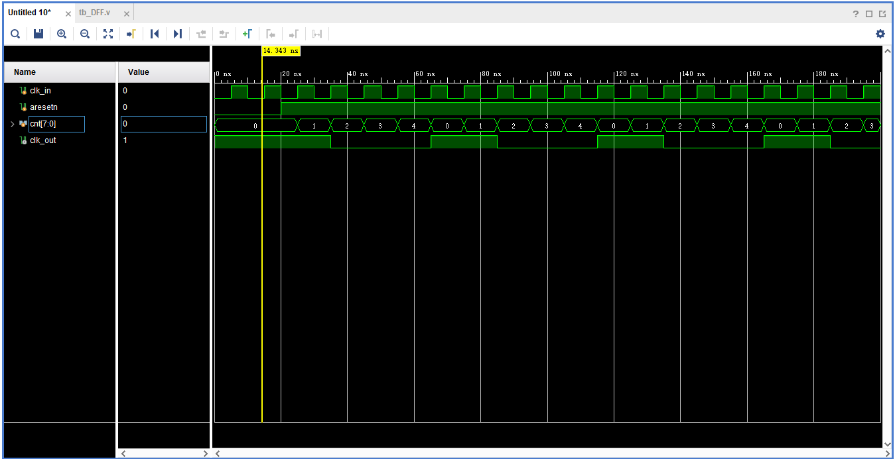

### D触发器和多路延迟  

#### 1. 最简单的D触发器  
```verilog
//设计文件
module DFF(
    input D,
    input clk,
    output reg Q
);

always@(posedge clk) begin
    Q <= D;
end

endmodule
```

```verilog
//testbench
`timescale  1ns / 1ps

module tb_DFF;

// DFF Parameters
parameter PERIOD  = 10;


// DFF Inputs
reg   D                                    = 0 ;
reg   clk                                  = 0 ;

// DFF Outputs
wire  Q                                    ;


initial
begin
    forever #(PERIOD/2)  clk=~clk;
end

DFF  u_DFF (
    .D                       ( D     ),

    .clk                     ( clk   ),


    .Q                       ( Q     ) 
);

initial
begin

    #(PERIOD*5);
    D = 1;

    #(PERIOD*5);

    $finish;
end

endmodule
```


#### 2. 异步复位D触发器  
```verilog
//设计文件
module DFF_asy(
    input D,
    input clk,
    input aresetn,
    output reg Q
);

always@(posedge clk or negedge aresetn) begin
    if(!aresetn)
        Q <= 0;
    else
        Q <= D;
end

endmodule
```

```verilog
//testbench
`timescale  1ns / 1ps

module tb_DFF_asy;

// DFF Parameters
parameter PERIOD  = 10;


// DFF Inputs
reg   D                                    = 0 ;
reg   clk                                  = 0 ;
reg aresetn                                = 0 ;
// DFF Outputs
wire  Q                                    ;

initial begin
    #(PERIOD*1.7);
    
    aresetn                                = 1 ;
    #(PERIOD*5);

    aresetn                                = 0 ;
    #(PERIOD);
    aresetn                                = 1 ;
end

initial
begin
    forever #(PERIOD/2)  clk=~clk;
end

DFF_asy  u_DFF (
    .D                       ( D     ),

    .clk                     ( clk   ),
    .aresetn                 (aresetn),

    .Q                       ( Q     ) 
);

initial
begin

    #(PERIOD*5);
    D = 1;

    #(PERIOD*5);

    $finish;
end

endmodule
```


#### 3. 同步复位D触发器  
```verilog
//设计文件
module DFF_sy(
    input D,
    input clk,
    input resetn,
    output reg Q
);

always@(posedge clk) begin  //同步复位
    if(!resetn)
        Q <= 0;
    else
        Q <= D;
end

endmodule
```

```verilog
//testbench
`timescale  1ns / 1ps

module tb_DFF_sy;

// DFF Parameters
parameter PERIOD  = 10;


// DFF Inputs
reg   D                                    = 0 ;
reg   clk                                  = 0 ;
reg resetn                                = 0 ;
// DFF Outputs
wire  Q                                    ;

initial begin
    #(PERIOD*1.7);
    
    resetn                                = 1 ;
    #(PERIOD*5);

    resetn                                = 0 ;
    #(PERIOD);
    resetn                                = 1 ;
end

initial
begin
    forever #(PERIOD/2)  clk=~clk;
end

DFF_sy  u_DFF (
    .D                       ( D     ),

    .clk                     ( clk   ),
    .resetn                 (resetn),

    .Q                       ( Q     ) 
);

initial
begin

    #(PERIOD*5);
    D = 1;

    #(PERIOD*5);

    $finish;
end

endmodule
```

  

#### 4. 锁存器  
```verilog
//设计文件
module latch_N#(    
    parameter N = 1
)(
    input[N-1:0] D,
    input clk,
    output[N-1:0] Q
);

assign Q = clk ? D : Q;  //锁存器
/*
下面HDL与上面生成电路是一样的 
唯一不同是上面生成的锁存器为Q_0 下面生成的为Q_reg
always@(*) begin
    if(clk)
        Q = D;    //锁存器
end
*/
endmodule
```

```verilog
//testbench
`timescale  1ns / 1ps

module tb_latch_N;   

// latch_N Parameters
parameter PERIOD = 10;
parameter N  = 1;

// latch_N Inputs
reg   [N-1:0]  D                           = 0 ;
reg   clk                                  = 0 ;

// latch_N Outputs
wire  [N-1:0]  Q                           ;


initial
begin
    forever #(PERIOD/2)  clk=~clk;
end


latch_N #(
    .N ( N ))
 u_latch_N (
    .D                       ( D    [N-1:0] ),
    .clk                     ( clk          ),

    .Q                       ( Q    [N-1:0] )
);

initial
begin
    #(PERIOD*2.7);
    D = 1;
    #(PERIOD*5.5);
    D = 0;
    #(PERIOD*4);
    $finish;
end

endmodule
```


#### 5. 多级延迟的触发器  
```verilog
//设计文件
module DFF #(
    parameter N = 1
) (
    input clk,
    input aresetn,
    input[N-1:0] D,
    output[N-1:0] D_rising_edge,
    output[N-1:0] D_falling_edge
);

reg[N-1:0] d0, d1, Q;

always@(posedge clk or negedge aresetn) begin
    if(!aresetn) begin
        d0 <= 0;
        d1 <= 0;
        Q <= 0;
    end
    else begin
        d0 <= D;
        d1 <= d0;
        Q <= d1;
    end
end

assign D_falling_edge = d0 & ~D;  //检测下降沿
assign D_rising_edge = ~d0 & D;   //检测上升沿

    
endmodule
```

```verilog
//testbench
`timescale  1ns / 1ps 

module tb_DFF;        

// DFF Parameters     
parameter PERIOD = 10;
parameter N  = 1;

// DFF Inputs
reg   clk                                  = 0 ;
reg   aresetn                              = 0 ;
reg   [N-1:0]  D                           = 0 ;

// DFF Outputs
wire  [N-1:0]  D_rising_edge               ;
wire  [N-1:0]  D_falling_edge              ;


initial
begin
    forever #(PERIOD/2)  clk=~clk;
end

initial
begin
    #(PERIOD*2) aresetn  =  1;
end

DFF #(
    .N ( N ))
 u_DFF (
    .clk                     ( clk                     ),
    .aresetn                 ( aresetn                 ),
    .D                       ( D               [N-1:0] ),

    .D_rising_edge           ( D_rising_edge   [N-1:0] ),
    .D_falling_edge          ( D_falling_edge  [N-1:0] )
);

initial
begin
    D = 0;
    # (PERIOD*3);

    D = 1;
    # (PERIOD*10);

    D = 0;
    # (PERIOD*5);

    D = 1;
    # (PERIOD*20);

    $finish;
end

endmodule
```




#### 6. 计数器  
```verilog
//设计文件
module updown_count#(parameter N=8)(
input clk,
input clear,
input load,
input up_down,
input [N-1:0] preset_D,
output[N-1:0] cnt_Q
);
reg[N-1:0] cnt;
assign cnt_Q = cnt;

always@(posedge clk)
  if(clear)
    cnt <= 'h0;      //同步清 0，高电平有效
  else if(load)
    cnt <= preset_D; //同步预置
  else if(up_down)
    cnt <= cnt+1;    //加法计数
  else
    cnt <= cnt-1;    //减法计数

endmodule
```

```verilog
//testbench
`timescale  1ns / 1ps  

module tb_updown_count;

// updown_count Parameters
parameter PERIOD  = 10;
parameter N=8;

// updown_count Inputs
reg   clk                                  = 0 ;
reg   clear                                = 1 ;
reg   load                                 = 0 ;
reg   up_down                              = 0 ;
reg   [N-1:0]  preset_D                    = 0 ;

// updown_count Outputs
wire  [N-1:0]  cnt_Q                       ;


initial
begin
    forever #(PERIOD/2)  clk=~clk;
end

initial
begin
    #(PERIOD*2) clear  =  0;
end

updown_count  u_updown_count (
    .clk                     ( clk               ),
    .clear                   ( clear             ),
    .load                    ( load              ),
    .up_down                 ( up_down           ),
    .preset_D                ( preset_D  [N-1:0] ),

    .cnt_Q                   ( cnt_Q     [N-1:0] )
);

initial
begin
    #(PERIOD*8.3);
    up_down = 1;

    preset_D = 100;
    #(PERIOD*5);

    load = 1;
    #(PERIOD);

    load = 0;
    up_down = 0;
    #(PERIOD*10);

    $finish;
end

endmodule

```


#### 7. 分频器（尽可能占空比1：1）
```verilog
//设计文件
module clk_div #(
    parameter cfactor = 5
)( 
    input clk_in,
    input aresetn,
    output clk_out
);

reg clk_loc;
reg[7:0] cnt;

assign clk_out = (cfactor == 1) ? clk_in : clk_loc;  //分频为1 时直接输出

always@(posedge clk_in or negedge aresetn) begin
    if(!aresetn) begin
        clk_loc <= 1;
        cnt <= 0;
    end
    else begin 
        cnt <= cnt + 1'b1;
        if(cnt == cfactor/2-1) begin  //中间到最后为0
            clk_loc <= 0;
        end
        else if(cnt == cfactor-1) begin  //最开始到中间为1
            cnt <= 0;
            clk_loc <= 1;
        end
    end
end

endmodule
```  

```verilog
//testbench
`timescale  1ns / 1ps

module tb_clk_div;   

// clk_div Parameters
parameter PERIOD   = 10;
parameter cfactor  = 5;

// clk_div Inputs
reg   clk_in                               = 0 ;
reg   aresetn                              = 0 ;

// clk_div Outputs
wire  clk_out                              ;


initial
begin
    forever #(PERIOD/2)  clk_in=~clk_in;
end

initial
begin
    #(PERIOD*2) aresetn  =  1;
end

clk_div #(
    .cfactor ( cfactor ))
 u_clk_div (
    .clk_in                  ( clk_in    ),
    .aresetn                 ( aresetn   ),

    .clk_out                 ( clk_out   )
);

initial
begin
    #(PERIOD*20);
    $finish;
end

endmodule
```

