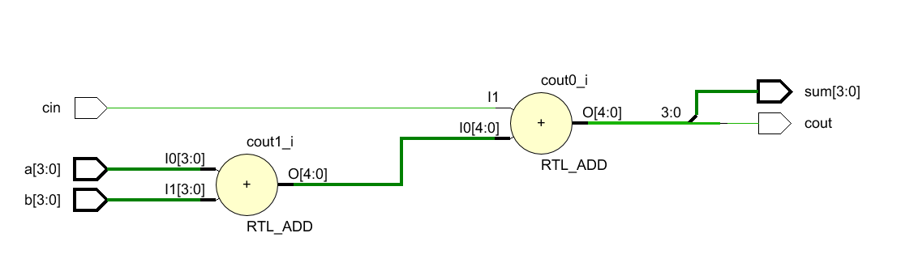
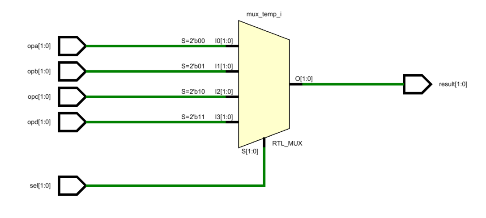
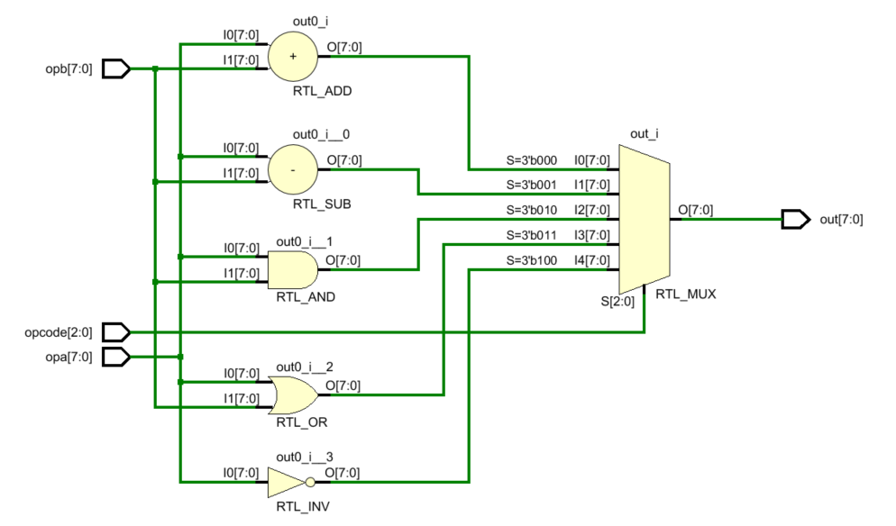
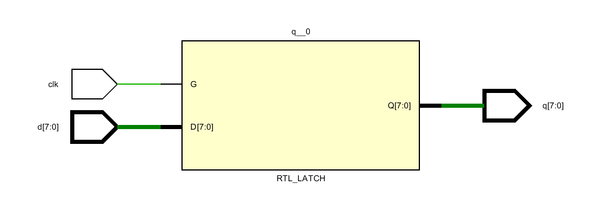
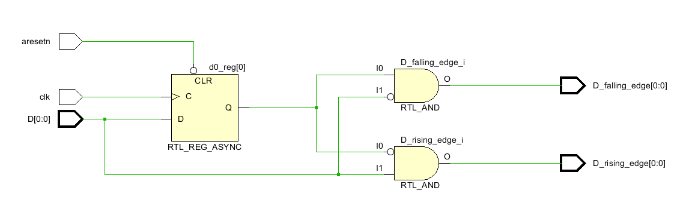
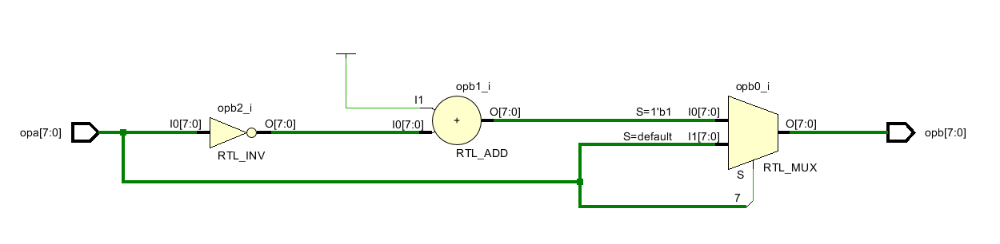

# 集成电路设计与HDL

摩尔定律：集成电路上所继承元器件数量，每隔18个月就翻一倍；或者微处理器的性能每隔18个月就提高一倍，或者价格下降一半。

IC设计中的“二八定律”：大部分成功的项目都是只做20%的更新，其余采用成熟设计或标准IP方案
芯片行业规律：变化是永恒的，不变的是隐藏在其后的集成化与系统化

芯片可理解为计算的固化过程，逻辑是设计出来的，不是仿出来的，更不是凑出来的，要看到逻辑背后的电路结构

系统级 -> 算法级 -> RTL级 -> 门级 -> 开关级

## adder

在描述电路时，一定不要编写不完全分支的电路结构，以免生成锁存
always语句块内部，任何一个语句块（begin开始 end结尾）都是串行执行的，只是存在赋值立刻生效以及事后生效的差异，这就是阻塞赋值和非阻塞赋值

## sel

## ALU

## latch_N

## [D触发器和多路延迟](D触发器与多路延迟.md)

## DFF

## DWF_absval
  

**3种逻辑功能描述方法：模块例化、数据流描述方式（assign）、行为描述方式（always、initial）**

**编写testbench要注重测试激励的产生、如何存储最终结果、如何比较结果、如果判别验证充分，掌握如何写系统任务、如何利用fork-join并发启动、如何简单地观测数据，并掌握如何存储数据波形**

testbench中无规律信号通常由两种生成方式： 1. 利用随机约束生成 2. 将时间行为存储在文件中，执行时刻依次取出其中的值，然后赋予激励向量
testbench中 $random返回一个有符号的32位整形随机数
reg[23:0] rand;
rand = $random%50;   //产生（-50，50）范围内的随机数
rand = min + {$random}%(max-min+1); （min, max） 内随机数

UART通信协议包括了最朴素的数字通信思想：
1. 通过协议规定收发双方的行为
2. 通过约定动作获得收发同步
3. 通过冗余实现容错传输